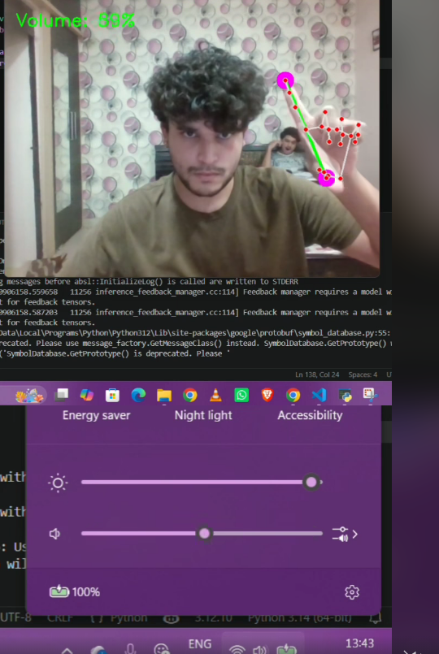

# Real-Time Gesture Controlled System for Laptop Volume Control

A computer vision project that lets users control their laptop's system volume using hand gestures, captured through a webcam in real time.

## Overview

This project explores real-time hand tracking to build a touch-free volume control system. Using webcam input, the system detects the distance between the thumb and index finger and maps that distance to the laptop's system volume, with live visual feedback shown on screen.

## Demo

Watch the system in action: [Demo Video (LinkedIn)](https://www.linkedin.com/posts/aditya-jain-4302031ba_built-a-real-time-gesture-controlled-system-ugcPost-7469665561271070720-TL50)

The system tracks hand landmarks in real time and adjusts volume based on the distance between the thumb and index finger, with the current volume percentage displayed on screen.

## Key Features

- Real-time hand tracking using MediaPipe
- Thumb and index finger landmark detection
- Distance-based gesture mapping to control volume
- Dynamic system volume control on Windows
- Live visual feedback using OpenCV

## Tech Stack

Language: Python
Libraries: OpenCV, MediaPipe, PyCAW

## How It Works

1. The webcam captures a live video feed
2. MediaPipe detects the hand and identifies key landmarks, including the thumb and index finger
3. The distance between these two landmarks is calculated in real time
4. This distance is mapped to a volume range and applied using PyCAW, which controls the Windows system volume
5. OpenCV overlays the hand landmarks and current volume level on the video feed for visual feedback

## What I Learned

This project helped me understand real-time computer vision pipelines, landmark detection, and how to build practical human-computer interaction systems. It also gave me hands-on experience integrating multiple libraries — MediaPipe for tracking, OpenCV for visualization, and PyCAW for system-level audio control.

## Future Improvements

Extending the system to support brightness control and additional gesture-based interactions.
